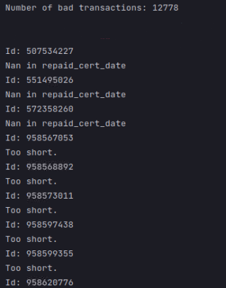

### Выявление несвоевременного или досрочного гашения ВСД ###

**! Исполняемый файл - get_time_anomaly.py**

Для работы программы необходимы библиотека pandas и два файла: ‘/data/Certificate_2020_ds_0.txt’ и ‘/data/labels_pretty.csv’. labels_pretty представляет собой обработанный “Разметка_обезличенная.xlsx”.

Файлы можно выкачать по ссылкам:
1. https://hakaton-rosselhoznadzor-2021.s3.eu-central-1.amazonaws.com/data/labels_pretty.csv
2. https://hakaton-rosselhoznadzor-2021.s3.eu-central-1.amazonaws.com/data/Certificate_2020_ds_0.txt

Алгоритм проверяет файл ‘/data/Certificate_2020_ds_0.txt’ и ищет один из следующих вариантов:
1.	repaid_cert_date равняется nan
2.	repaid_cert_date - cert_date сильно отличается от transit_time_hour
3.	repaid_cert_date - cert_date больше определенного значения
4.	repaid_cert_date - cert_date меньше определенного значения
5.	Если id транзакции уже помечен в labels_pretty как нарушитель сроков, то эта транзакция игнорируется. Ищутся только новые нарушения.

Пример вывода программы - список эВСД с нарушениями: 

### Обработка классов

**! Исполняемый файл - label_embeddings_clustering.py**

Для сокращения более 300 уникальных классов ошибок, многие из которых различаются исключительно формулировками и грамматическим оформлением,  использовались готовые эмбединги меток (sentence-transformers) для русского языка, на которых производилась кластеризация.
После применения данной техники удалось значительно сократить количество уникальных описаний нарушений. Оставшиеся же были сведены в 15 категорий ручными усилиями

Для запуска кода потребуются библиотеки:
* ``numpy``
* ``pandas``
* ``sklearn``